# TECH CUP FÚTBOL - Frontend

## Integrantes

- **Andres Felipe Cardozo**
- **Juan Camilo Cristancho**
- **Juan David Gómez**
- **Mariana Malagón**
- **Sebastian Castillejo**

---

## Contexto del proyecto

Aplicación web para la gestión de torneos universitarios TECH CUP FÚTBOL.  
Permite registrar equipos, validar pagos y buscar jugadores.  
Incluye módulos para administración de torneos, gestión de usuarios y visualización de partidos.

---

## Logotipo

---

## Manual de identidad visual

https://pruebacorreoescuelaingeduco.sharepoint.com/:p:/s/DOSW-2026-1/IQA1oPTMzFDaSpldO_fjkOzEAQrW69M2W3Ogkj8GeMJL3mQ?e=SzFiPT

---

## Mockups del sistema

https://www.figma.com/design/tDLGUeXBQ7ROjQXduZtsp3/TechCup-Futbol?node-id=0-1&t=sBdHvlgACD74lxO5-1

## Módulos de la Aplicación Web

### 1. **Autenticación y Gestión de Usuarios**

Permite el registro, inicio de sesión y gestión de perfiles deportivos.  
*Funcionalidades*:
- Registro mediante correo institucional/Gmail
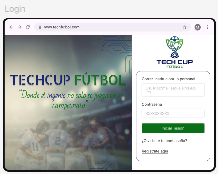
- Sistema de roles
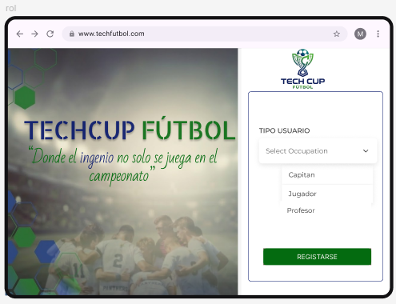
- Creación de perfil deportivo 
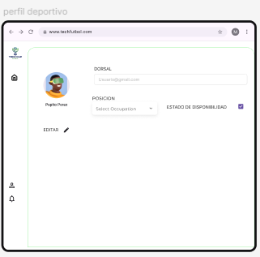
- Marcado de disponibilidad para fichaje
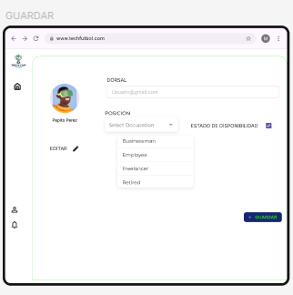

---

### 2. **Gestión de Torneos**

Solo el organizador puede crear, modificar y finalizar torneos.  
*Funcionalidades:*
- Creación de torneos con fechas, equipos y estados

- Configuración de detalles del torneo (reglamento, horarios, sanciones)
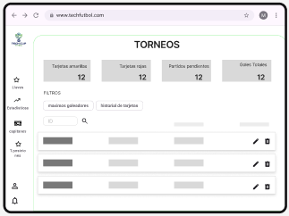

---

### 3. **Gestión de Equipos**

Capitanes y jugadores pueden crear equipos, invitar miembros y gestionar la plantilla.  
*Funcionalidades:*
- Creación de equipos
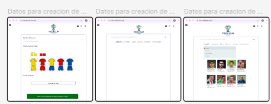
- Invitación y aceptación/rechazo de jugadores
- Control de plantilla y restricción de doble inscripción

---

### 4. **Búsqueda de Jugadores**

Capitanes pueden buscar y filtrar jugadores por diferentes criterios.  
*Funcionalidades:*
- Búsqueda por posición, semestre, edad, género, nombre, identificación
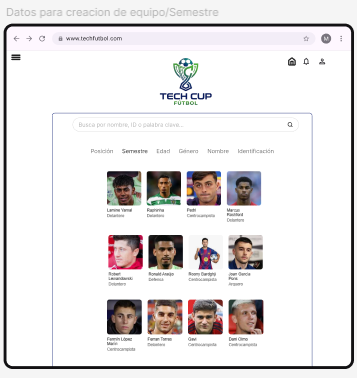

---

### 5. **Pagos e Inscripción de Equipos**

Gestión de comprobantes de pago y estado del proceso de inscripción.  
*Funcionalidades:*
- Subida de comprobante de pago
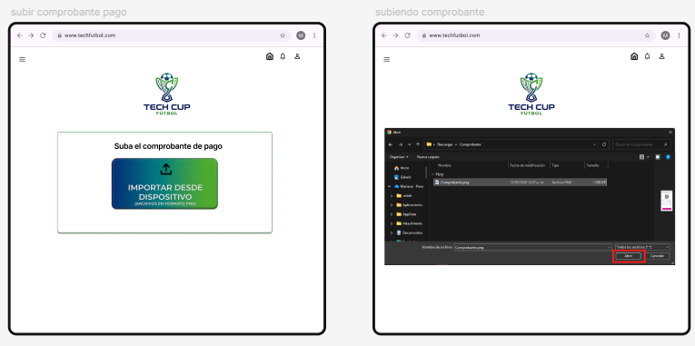
- Validación por organizador

- Notificación de estado

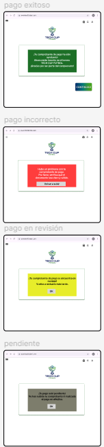

---

### 6. **Alineaciones y Formaciones**

Módulo táctico para fijar alineaciones antes del partido.  
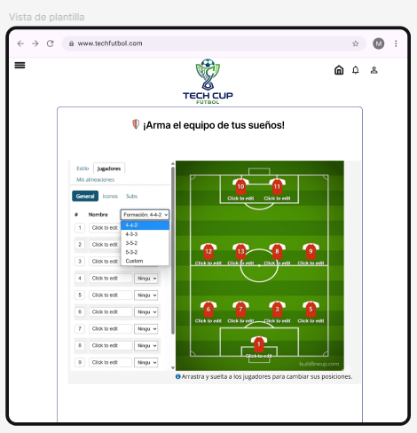
*Funcionalidades:*
- Gestión de alineación hasta una hora antes del partido
- Visualización de diferentes formaciones

---

### 7. **Gestión de Partidos**

Registro de resultados, designación de árbitros y consulta de información de partidos.  
*Funcionalidades:*
- Registro de marcador, goleadores y tarjetas
- Designación de árbitros, consulta de partidos asignados

---

### 8. **Tabla de Posiciones y Estadísticas**

Visualización automática de tabla de posiciones, goleadores y tarjetas.  
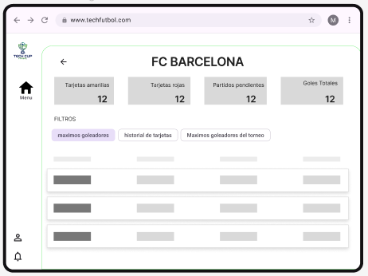
*Funcionalidades:*
- Generación automática de tabla
- Estadísticas de jugadores y equipos

---

### 9. **Llaves Eliminatorias**
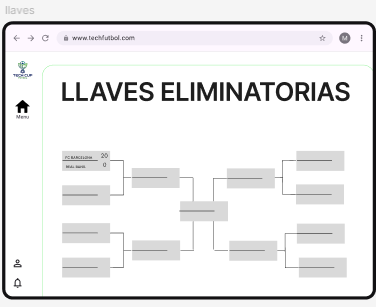

Automatización de emparejamientos para la fase final.  
*Funcionalidades:*
- Generación automática de llaves de eliminación

---

