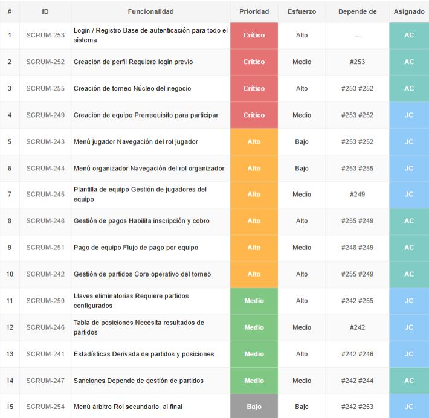

# TECH CUP FÚTBOL - Frontend

## Matriz de trazabilidad

## Índice

- [Integrantes](#integrantes)
- [Contexto del proyecto](#contexto-del-proyecto)
- [Logotipo](#logotipo)
- [Manual de identidad visual](#manual-de-identidad-visual)
- [Mockups del sistema](#mockups-del-sistema)
- [Módulos de la Aplicación Web](#módulos-de-la-aplicación-web)
  - [Inicio (antes de iniciar sesión)](#inicio-para-mostrar-a-los-usuarios-antes-de-que-inicien-sesión)
  - [1. Autenticación y Gestión de Usuarios](#1-autenticación-y-gestión-de-usuarios)
  - [2. Gestión de Torneos](#2-gestión-de-torneos)
  - [3. Gestión de Equipos](#3-gestión-de-equipos)
  - [4. Búsqueda de Jugadores](#4-búsqueda-de-jugadores)
  - [5. Pagos e Inscripción de Equipos](#5-pagos-e-inscripción-de-equipos)
  - [6. Alineaciones y Formaciones](#6-alineaciones-y-formaciones)
  - [7. Gestión de Partidos](#7-gestión-de-partidos)
  - [8. Tabla de Posiciones y Estadísticas](#8-tabla-de-posiciones-y-estadísticas)
  - [9. Llaves Eliminatorias](#9-llaves-eliminatorias)
- [Sustento y justificación técnica](#sustento-y-justificación-técnica)

## Integrantes

- **Andres Felipe Cardozo**
- **Juan Camilo Cristancho**
- **Juan David Gómez**
- **Mariana Malagón**
- **Sebastian Castillejo**

---

## Contexto del proyecto

Aplicación web para la gestión de torneos universitarios TECH CUP FÚTBOL.  
Permite registrar equipos, validar pagos y buscar jugadores.  
Incluye módulos para administración de torneos, gestión de usuarios y visualización de partidos.

## Requisitos

- Node.js v18 o superior
- npm v9 o superior

## Correr el proyecto

1. Clona el repositorio y entra a la carpeta del proyecto.
2. Instala las dependencias: npm install
3. Inicia el servidor de desarrollo: npm run dev
4. Abre http://localhost:5173 en el navegador.

---

## Logotipo

---

## Manual de identidad visual

[Manual de identidad visual (SharePoint)](https://pruebacorreoescuelaingeduco.sharepoint.com/:p:/s/DOSW-2026-1/IQA1oPTMzFDaSpldO_fjkOzEAQrW69M2W3Ogkj8GeMJL3mQ?e=SzFiPT)  
Este enlace dirige a la presentación oficial con lineamientos de marca, uso de colores y elementos visuales.

---

## Mockups del sistema

[Mockups del sistema en Figma](https://www.figma.com/design/tDLGUeXBQ7ROjQXduZtsp3/TechCup-Futbol?node-id=0-1&t=sBdHvlgACD74lxO5-1)  
Este enlace permite revisar el diseño base, pantallas y flujo visual de la aplicación.

---

## Sustento y justificación técnica

En este repositorio no solo se encuentran los artefactos funcionales del frontend, también el criterio técnico detrás de su diseño y evolución.

- Cada requerimiento se discutió y organizó priorizando bajo acoplamiento, alta cohesión y facilidad de mantenimiento.
- Los módulos y funcionalidades se definieron a partir de los flujos críticos del torneo estudiantil (registro, equipos, pagos, partidos y fases eliminatorias).
- La estructura de interfaz y la lógica por roles se fundamentan en principios de seguridad, usabilidad y trazabilidad de acciones.
- La base técnica con React y Vite permite iteración rápida, escalabilidad del código y una experiencia consistente para usuario final y equipo de desarrollo.

---

